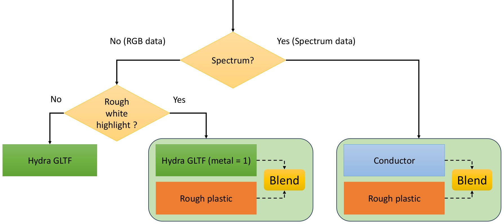
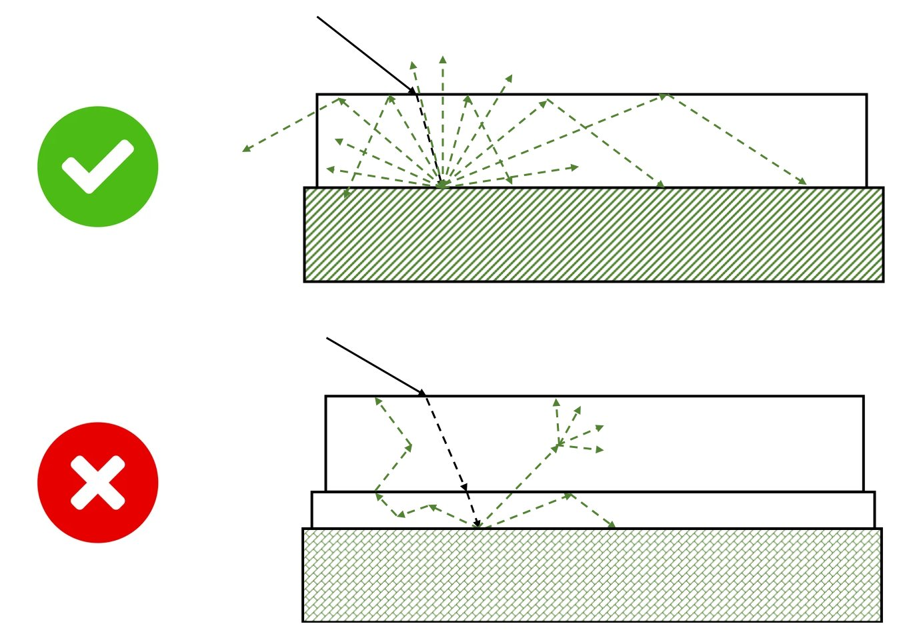
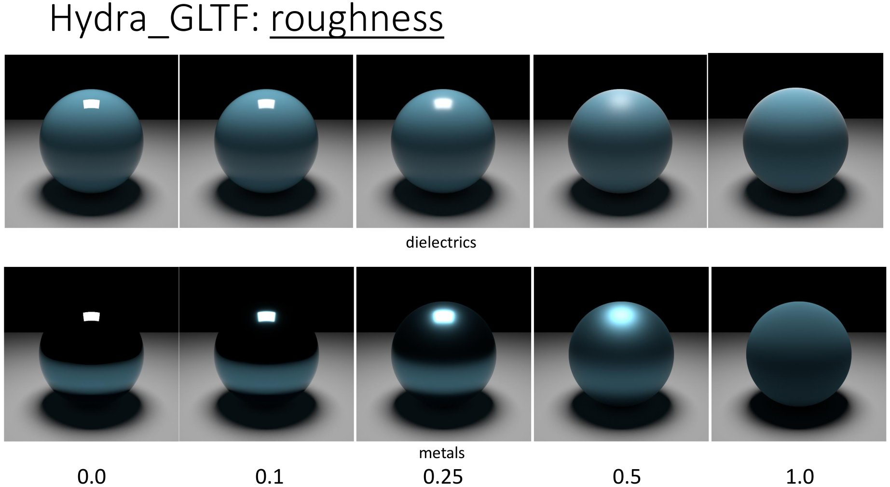
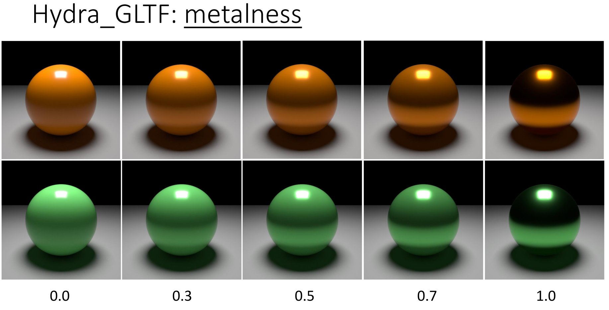
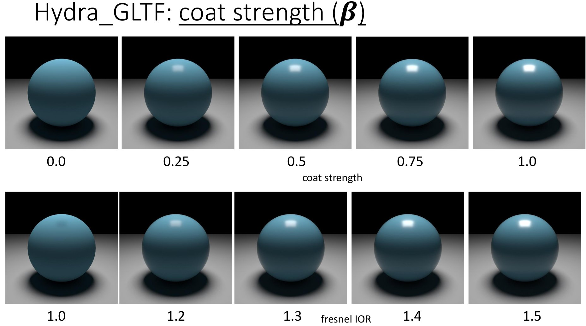
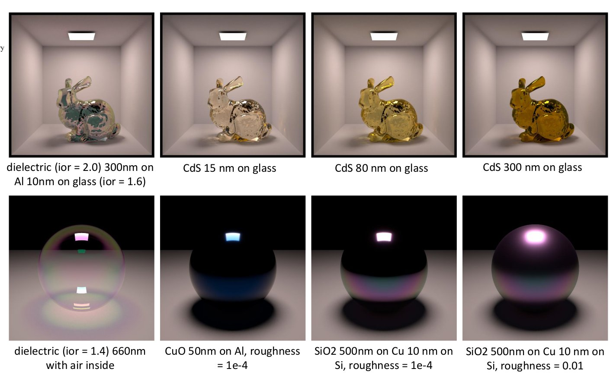

# Hydra Renderer XML format for scenes
Hydra Renderer uses XML representation for scenes. Older (used by [HydraCore2](https://github.com/Ray-Tracing-Systems/HydraCore) but still mostly valid) and detailed description can be found in [HydraAPI repo](https://github.com/Ray-Tracing-Systems/HydraAPI/blob/master/doc/doc_xml/hydra_xml.tex).

Here we will mainly describe scene components specific for HydraCore3.

## Introduction

In HydraCore3, we have implemented the core material models that align with physically accurate material models in rendering. Our implementation corresponds with similar models in physically correct rendering systems such as PBRT4 and Mitsuba3 (average PNSR is 40-45). 

We categorize material models into (1) a universal material model and (2) specific materials. 

1. The **Universal Material Model (UMM)** is a construct composed of individual BRDF components to represent the most commonly encountered materials characterized solely by reflection. It encompasses traditional capabilities such as diffuse reflection, conductors, dielectrics and coating. However, the basic components used in the universal material model can also be utilized as standalone materials.

2. Specific material models, such as those for glass, thin films, hair, subsurface scattering and other, are intended for accurate modeling of particular phenomena.

Please note that some BRDFs made only for RGB mode while others works correctly only for spectral renderinhg. If you are working with the universal material model, you must configure it **differently depending on whether the scene is spectral or not** (fig.1). Fortunately, we strive to implement spectrum upsampling automatically during scene loading if the rendering is initiated with the --spectral flag.

### Universal Material Model (UMM)


*Figure 1: Universal Material model setup in HydraCore3*

There are 3 ways (i.e. 3 levels of accurancy) of setting UMM model in HydraCore3. Each next level is a more accurate physical simulation of the same physical phenomena, so in general they does same thing. However with increasing accuracy the computational complexity is also increases.

1. (Level 1) In RGB mode you can set up **HydraGLTF** model which is itself a simple and cheap physically correct analogue of gltf spec. The HydraGLTF model in fact is a blend of coated diffuse (called smooth plastic in Mitsuba 3) and Shlick-based metal. This is the most common situation for so called PBR/GLTF scenes (left part of fig. 1). The HydraGLTF model itself accounts for internal reflection between Lambert substrate and coating layer (with subsequent energy loss, fig.2). However this energly loss could be inaccurate when the coating layer became significantly rough (roughness > 0.75 or glossiness < 0.25). 

2. (Level 2) In the case when you have rough coating layer, it is recommended to make manual blend of Plastic material (which corresponds to Mitsuba3 "Rough Plastic") with metallic compoment of HydraGLTF by setting metalness parameter equal to 1 in HydraGLTF (middle part of fig. 1).

3. (Level 3) For rendering in spectrum you shoud replace metal component (which is modelled with HydraGLTF on level 2) with Conductor material (right part of fig. 1). This is due to the fact that the color of metal we observe is actually determined by its complex refractive index (and consequently its reflectivity), which varies with wavelength. Therefore, strictly speaking, if you want to accurately model metals, you need to simulate light transport in the spectral domain.

<br><br>
*Figure 2: Accounted interreflections and energy loss in UMM components (HydraGLTF and Plastic)*

## General xml scheme
All materials in the scene are specified inside ```<materials_lib>``` parent node as ```<material>``` child nodes. Material type is set using *type* attribute.

For example:

```
<materials_lib>
  <material id="0" name="gray_material" type="diffuse">
    <bsdf type="lambert" />
    <reflectance val="0.5 0.5 0.5" />
  </material> 
</materials_lib>
```

Some material parameters can be set with a texture or spectrum. To do this add a child node (`<texture>` or `<spectrum>`) to the respective parameter. This child node should contain a reference by id to a previously declared texture or spectrum in `<texture_lib>` or `<spectra_lib>` parts of the XML description. 

For example:
```
<textures_lib>
  <texture id="0" name="Map#0" loc="Tests/data/chunk_00000.image4ub" bytesize="16" width="2" height="2" />
  <texture id="1" name="my_texture" loc="data/chunk_00000.image4ub" bytesize="262144" width="256" height="256" />
</textures_lib>
<spectra_lib>
  <spectrum id="0" name="Au.eta" loc="data/spd/Au.eta.spd" />
  <spectrum id="1" name="Au.k" loc="data/spd/Au.k.spd" />
  <spectrum id="2" name="d50" loc="data/spd/cie.stdillum.D5000.spd" />
</spectra_lib>
<materials_lib>
  <material id="0" name="conductor_texture" type="rough_conductor">
    <bsdf type="ggx" />
    <alpha val="0.1" >
      <texture id="1" type="texref" matrix="1 0 0 0 0 1 0 0 0 0 1 0 0 0 0 1" addressing_mode_u="wrap" addressing_mode_v="wrap" input_gamma="1.0" input_alpha="rgb" />
    </alpha>
    <eta val="1.5">
      <spectrum id="0" type="ref"/>
    </eta>
    <k val="1.0">
      <spectrum id="1" type="ref"/>
    </k>
  </material>
</materials_lib>
```

## List of materials

HydraCore3 implements several material models:
* lambertian diffuse
* conductor 
* dielectric with ideal reflection and refraction (glass)
* plastic (diffuse material with thin dielectric coat)
* blend material (allows to combine two materials using a mask)
* gltf-like material - mix of metallic, dielectric and diffuse reflections

### GLTF / HydraGLTF [RGB]

| Node | Attributes | Texture | Spectrum |
| --- | --- | --- | --- |
| color  | `val` - base color, 1, 3 or 4 floats | yes | no |
| metalness   | `val` - float, possible values - 0.0 .. 1.0 | yes | no |
| coat        | `val` - float, possible values - 0.0 .. 1.0 | yes | no |
| glossiness  | `val` - float, possible values - 0.0 .. 1.0 | yes | no |
| fresnel_ior | `val` - float, possible values - 1.0 .. 50.0 | no | no |

Examples:

```
<material id="4" name="plastic" type="gltf">
  <color val="0.1 0.27 0.36" />
  <metalness val = "0.0" />
  <coat val = "1.0" />
  <glossiness val= "0.75"/>
  <fresnel_ior val="1.5" />
</material>
```

In HydraGLTF you may pack several single-chennal textures to one RGB texture in fixed order (glossiness in red channel, metalness in green and coat strength in blue): 

```
<material id="4" name="plastic" type="gltf">
  <color val="0.6 0.6 0.1" />
  <glossiness_metalness_coat val="1.0">
    <texture id="2" type="texref" ... />
  </glossiness_metalness_coat> 
  <fresnel_ior val="1.5" />
</material>
```


*Figure 3: Various roughness values in HydraGLTF component of material. If glosiness set, glosiness equals to 1.0 - roughness*


*Figure 4: Various metalness values in HydraGLTF component of material:*


*Figure 5: Various coat values (coat strength) parameter in HydraGLTF component of material:*

### Diffuse [RGB, Spectral]

| Node | Attributes | Texture | Spectrum |
| --- | --- | --- | --- |
| bsdf  | `type` - bsdf model, possible values - `lambert` | - | - |
| reflectance | `val` - color, possible values - 1, 3 or 4 floats | yes | yes |

Examples:

```
<materials_lib>
  <material id="0" name="red_material" type="diffuse">
    <bsdf type="lambert" />
    <reflectance val="0.5 0.0 0.0" />
  </material>
  <material id="1" name="gray_material" type="diffuse">
    <bsdf type="lambert" />
    <reflectance val="0.5" />
  </material>
  <material id="2" name="texture_material" type="diffuse">
    <bsdf type="lambert" />
    <reflectance val="0.5">
      <texture id="1" type="texref" />
    </reflectance>
  </material>  
  <material id="3" name="spectral_diffuse" type="diffuse">
    <bsdf type="lambert" />
    <reflectance val="1.0">
      <spectrum id="1" type="ref"/>
    </reflectance>
  </material> 
</materials_lib>
```

### Conductor [Spectral]

Models conductive materials with complex Fresnel IOR: eta (refractive index) and k (extinction coefficient). 
Generally, should be used in *spectral* rendering mode (pass `--spectral` in command line). In RGB mode you can use *reflectance* parameter to specify color (not physically correct).

Spectra can be found, for example, [here](https://refractiveindex.info/)

| Node | Attributes | Texture | Spectrum |
| --- | --- | --- | --- |
| bsdf  | `type` - bsdf model, possible values - `ggx` | - | - |
| alpha  | `val` - microfacet roughness, used to set `alpha_u` and `alpha_v` to the same value, possible values - 1 float | yes | no |
| alpha_u  | `val` - microfacet roughness in u direction, possible values - 1 float | no | no |
| alpha_v  | `val` - microfacet roughness in v direction, possible values - 1 float | no | no |
| eta  | `val` - refractive index, possible values - 1 float | no | yes |
| k  | `val` - extinction coefficient, possible values - 1 float | no | yes |
| reflectance  | `val` - color multiplier, used in RGB mode to set color, no effect in spectral mode, not physically correct, possible values - 3 floats | no | no |

Examples:

```
<materials_lib>
  <material id="0" name="conductor" type="rough_conductor">
    <bsdf type="ggx" />
    <alpha val="0.1" />
    <eta val="1.5">
      <spectrum id="1" type="ref"/>
    </eta>
    <k val="1.0">
      <spectrum id="2" type="ref"/>
    </k>
  </material>
  <material id="1" name="conductor_anisotropic" type="rough_conductor">
    <bsdf type="ggx" />
    <alpha_u val="0.25" />
    <alpha_v val="0.01" />
    <eta val="0.0" />
    <k val="1.0" />
  </material>
  <material id="2" name="conductor_texture" type="rough_conductor">
    <bsdf type="ggx" />
    <alpha val="0.1" >
      <texture id="1" type="texref" matrix="1 0 0 0 0 1 0 0 0 0 1 0 0 0 0 1" addressing_mode_u="wrap" addressing_mode_v="wrap" input_gamma="1.0" input_alpha="rgb" />
    </alpha>
    <eta val="1.5" />
    <k val="1.0" />
  </material>
  <material id="3" name="conductor_rgb_mode" type="rough_conductor">
    <bsdf type="ggx" />
    <alpha_u val="0.1" />
    <alpha_v val="0.1" />
    <eta val="1.5" />
    <k val="1.0" />
    <reflectance val ="1.0 0.782 0.344" />
  </material>
</materials_lib>
```

### Ideal dielectric (glass) [RGB, Spectral]

Material with ideal specular reflection and refraction. Can be used with spectral refraction coefficient.


| Node | Attributes | Texture | Spectrum |
| --- | --- | --- | --- |
| int_ior  | `val` - internal index of refraction, possible values - 1 float | no | yes |
| ext_ior  | `val` - external index of refraction, possible values - 1 float | no | no |
Examples:

```
<materials_lib>
  <material id="0" name="glass" type="dielectric">
    <int_ior val="1.5" />
    <ext_ior val="1.0" />
  </material>
  <material id="1" name="spectral-dielectric" type="dielectric">
    <int_ior val="1.4585">
      <spectrum id="1" type="ref"/>
    </int_ior>
    <ext_ior val="1.00028" />
  </material>
</materials_lib>
```

### Plastic [RGB, Spectral]

This material model was ported from Mitsuba3 render. Essentially it represents a diffuse surface coated a thin dielectric layer.

| Node | Attributes | Texture | Spectrum |
| --- | --- | --- | --- |
| reflectance  | `val` - diffuse color, possible values - 1, 3 or 4 floats | yes | yes |
| int_ior  | `val` - internal index of refraction, possible values - 1 float | no | no |
| ext_ior  | `val` - external index of refraction, possible values - 1 float | no | no |
| alpha  | `val` - microfacet roughness, possible values - 1 float | no | no |
| nonlinear  | `val` - turn on/off nonlinear color shifts due to internal scattering, possible values - 1 or 0 | no | no |

Examples:

```
<materials_lib>
  <material id="0" name="plastic_smooth" type="plastic">
    <reflectance val="0.1 0.27 0.36" />
    <int_ior val="1.9"/>
    <ext_ior val="1.000277"/>
    <alpha val="0.0001"/>
    <nonlinear val="0"/>
  </material>
  <material id="1" name="plastic_rough" type="plastic">
    <reflectance val="1 1 1">
      <texture id="1" type="texref" matrix="-1 0 0 0 0 1 0 0 0 0 1 0 0 0 0 1" addressing_mode_u="wrap" addressing_mode_v="wrap" input_alpha="rgb" />
    </reflectance>
    <int_ior val="1.9"/>
    <ext_ior val="1.000277"/>
    <alpha val="0.2"/>
    <nonlinear val="0"/>
  </material>
</materials_lib>
```

### Blend [RGB, Spectral]

Meta-material used to combine two child materials (which can also be blends) using a mask.
Materials are combined as:

`weight * mat2 + (1 - weight) * mat1` 

| Node | Attributes | Texture | Spectrum |
| --- | --- | --- | --- |
| weight  | `val` - mixing weight, possible values - 1 float | yes | no |
| bsdf_1  | `id` - id of the first material (already defined in the XML description), possible values - 1 integer, | no | no |
| bsdf_2  | `id` - id of the first material (already defined in the XML description), possible values - 1 integer, | no | no |

Examples:

```
<materials_lib>
  <material id="1" name="cuprum" type="rough_conductor">
    <bsdf type="ggx" />
    <alpha val="0.1" />
    <eta val="1.5">
      <spectrum id="1" type="ref"/>
    </eta>
    <k val="1.0">
      <spectrum id="2" type="ref"/>
    </k>
  </material>
  <material id="2" name="argentum" type="rough_conductor">
    <bsdf type="ggx" />
    <alpha val="0.025" />
    <eta val="1.5">
      <spectrum id="3" type="ref"/>
    </eta>
    <k val="1.0">
      <spectrum id="4" type="ref"/>
    </k>
  </material>
  <material id="3" name="blend" type="blend">
    <weight val="1.0">
      <texture id="1" type="texref" matrix="8 0 0 0 0 8 0 0 0 0 1 0 0 0 0 1" addressing_mode_u="wrap" addressing_mode_v="wrap" input_gamma="1.0" input_alpha="rgb" />
    </weight>
    <bsdf_1 id="1" />
    <bsdf_2 id="2" />
  </material>
</materials_lib>
```

### Thin film [Spectral]

Models material consisting of thin layers with complex Fresnel IOR: eta (refractive index) and k (extinction coefficient). 
Generally, should be used in *spectral* rendering mode (pass `--spectral` in command line). In RGB mode colors are preintegrated for D65 source.

Spectra can be found, for example, [here](https://refractiveindex.info/)

| Node | Attributes | Texture | Spectrum |
| --- | --- | --- | --- |
| bsdf  | `type` - bsdf model, possible values - `ggx` | - | - |
| alpha  | `val` - microfacet roughness, used to set `alpha_u` and `alpha_v` to the same value, possible values - 1 float | yes | no |
| eta  | `val` - internal refractive index, possible values - 1 float | no | yes |
| k  | `val` - internal extinction coefficient, possible values - 1 float | no | yes |
| ext_ior  | `val` - external index of refraction, possible values - 1 float | no | no |
| thickness_map  | `min` and `max` - limits of thickness for 1-layer film, possible values - 1 float | yes | no |
| transparent  | `val` - on/off transparency, possible values - `1` and `0` | no | yes |

Layers are stacked in <layers> block and have these parameters:
| eta  | `val` - refractive index, possible values - 1 float | no | yes |
| k  | `val` - extinction coefficient, possible values - 1 float | no | yes |
| thickness  | `val` - thickness of layer, possible values - 1 float | no | yes |

Examples:

```
<materials_lib>
  <material id="0" name="thin_film_0" type="thin_film">
    <bsdf type="ggx" />
    <ext_ior val="1"/>
    <alpha val="0.0" />
    <transparent val="0"/>
    <eta val="1.0">
    </eta>
    <k val="0.0">
    </k>
    <layers>
      <layer>
        <thickness val="300" />
        <eta val="2.0">
        </eta>
        <k val="0.0">
        </k>
      </layer>
      <layer>
        <thickness val="5" />
        <eta val="1.0">
          <spectrum id="1" type="ref"/>
        </eta>
        <k val="1.0">
          <spectrum id="2" type="ref"/>
        </k>
      </layer>
      <layer>
        <thickness val="1000" />
        <eta val="1.6">
        </eta>
        <k val="2.0">
        </k>
      </layer>
    </layers>
  </material>
  <material id="1" name="thin_film_1" type="thin_film">
    <bsdf type="ggx" />
    <alpha val="0.01" />
		<eta val="1.0">
			<spectrum id="3" type="ref"/>
		</eta>
		<k val="0.0">
			<spectrum id="4" type="ref"/>
		</k>
    <thickness_map min="100" max="550">
      <texture id="1" type="texref" matrix="1 0 0 0 0 1 0 0 0 0 1 0 0 0 0 1" addressing_mode_u="wrap" addressing_mode_v="wrap" input_gamma="2.20000005" input_alpha="rgb" />
    </thickness_map>
    <layers>
      <layer>
        <thickness val="550" />
        <eta val="1.33">
          <spectrum id="1" type="ref"/>
        </eta>
        <k val="0.0">
          <spectrum id="2" type="ref"/>
        </k>
      </layer>
    </layers>
  </material>
</materials_lib>
```


*Figure 6: Various examples of thin film material*

